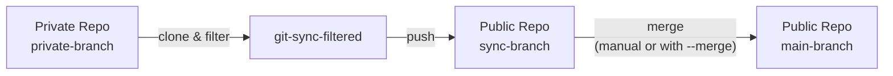

# git-sync-filtered

A thin wrapper around [git-filter-repo](https://github.com/newren/git-filter-repo) for syncing filtered commits from a private repository to a public repository.

## Installation

### uv (recommended)

```bash
uv tool install git+https://github.com/Merge-42/git-sync-filtered
```

### uvx (run without installing)

```bash
uvx git+https://github.com/Merge-42/git-sync-filtered \
  --private git@github.com:org/private.git \
  --public git@github.com:org/public.git \
  --keep src \
  --keep docs
```

### pip

```bash
pip install git+https://github.com/Merge-42/git-sync-filtered
```

## Usage

```bash
git-sync-filtered \
  --private git@github.com:org/private.git \
  --public git@github.com:org/public.git \
  --keep src \
  --keep docs
```

Or use a file to specify paths:

```bash
# paths.txt
# src
# docs
# README.md

git-sync-filtered \
  --private git@github.com:org/private.git \
  --public git@github.com:org/public.git \
  --keep-from-file paths.txt
```

### Options

- `--private` - Private repo path or URL (required)
- `--public` - Public repo path or URL (required)
- `--keep` - Paths to keep (can specify multiple, required)
- `--keep-from-file` - File containing paths to keep (one per line, lines starting with # are comments)
- `--sync-branch` - Sync branch name (default: upstream/sync)
- `--main-branch` - Main branch name (default: main)
- `--private-branch` - Private branch to sync from (default: main)
- `--dry-run` - Show what would happen without making changes
- `--merge` - Merge into main branch after sync
- `--force` - Force push

## How it works

1. Clones the private repository
2. Runs git-filter-repo to filter to only the specified paths
3. Pushes filtered commits to the public repository's sync branch
4. Optionally merges the sync branch into main

The sync branch can then be merged into main manually or with `--merge`.

## Workflow



## Requirements

- Python 3.10+
- git >= 2.36.0
