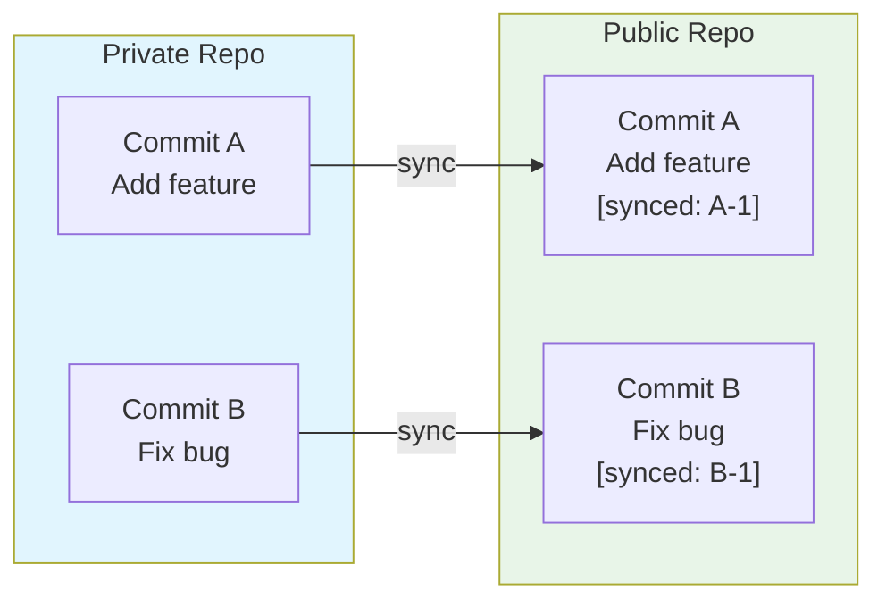
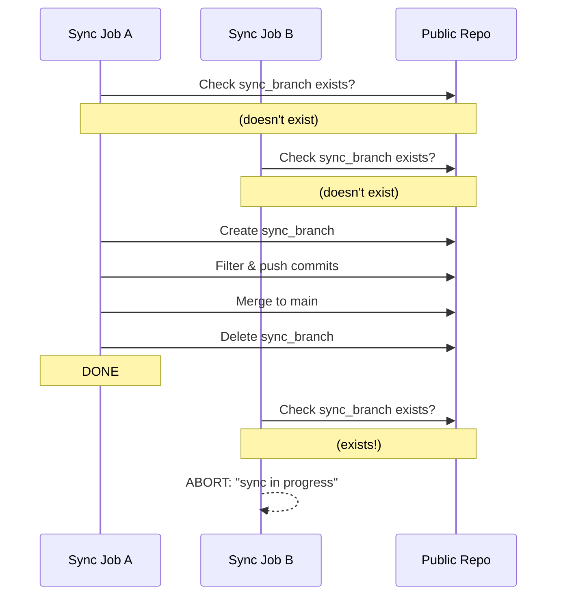

# Code Review Report: Functional Alignment Analysis

## Summary

Based on analysis of the codebase, there are **critical gaps** between the desired behavior and the implementation, specifically around **idempotency**.

---

## Desired Behavior

Given a private source branch and a public destination branch:

1. A sync job can be configured with a set of filters to allow a subset of files to be synced to the destination
2. Any commit that contains one or more of the allowed files should be filtered appropriately and mirrored on the destination along with its commit metadata
3. **No duplicate commits (i.e. commits that have been synced previously) should be synced on subsequent runs (i.e. idempotent)**

---

## Functional Alignment Matrix

| Requirement                         | Status               | Implementation                            |
| ----------------------------------- | -------------------- | ----------------------------------------- |
| Private source → Public destination | ✅ Supported         | `--private` / `--public` options          |
| Filter configuration (keep paths)   | ✅ Supported         | `--keep` / `--keep-from-file` options     |
| Commit filtering with metadata      | ✅ Supported         | Uses `git-filter-repo --partial`          |
| **Idempotent syncing**              | ❌ **NOT Supported** | No mechanism to prevent duplicate commits |

---

## Critical Issue: No Idempotency

**The implementation is NOT idempotent.** Every run pushes ALL commits from the private branch, creating duplicates on subsequent runs.

### Root Cause

In `sync.py:111-120`:

```python
# Every run clones fresh (line 114)
private_repo = git.Repo.clone_from(private, str(private_clone))

# Filters ALL commits in history (line 116)
run_filter_repo(str(private_clone), paths_to_keep)

# Pushes ALL commits to sync_branch (line 70-71 in push_to_remote)
refspec = f"refs/heads/{private_branch}:refs/heads/{sync_branch}"
repo.remote("public").push(refspec=refspec, force=force)
```

There is **no mechanism** to:

1. Track the last synced commit SHA
2. Only sync new commits
3. Detect/avoid duplicate commits

The `--force` flag (line 71) only overwrites the branch, it doesn't prevent duplicate commits from being pushed.

### Additional Technical Notes

- **`--partial` flag** (`sync.py:38`): This flag makes filtering faster by not rewriting commits that don't change the result, but it does NOT provide incremental syncing. It still operates on a fresh clone every time.
- **`--state-branch`**: git-filter-repo supports `--state-branch` for incremental filtering, but this feature is **not currently used** in the implementation.

### Evidence

1. **No idempotency tests exist** - All tests in `tests/integration/test_sync.py` only test single-run scenarios (lines 10-67)
2. **No state tracking** - No code stores/retrieves last synced commit information (entire `sync.py`)
3. **Fresh clone each run** - Every execution starts from scratch (`sync.py:114` - `git.Repo.clone_from`)

---

## Answers from Requirements

| Question             | Answer                                                                            |
| -------------------- | --------------------------------------------------------------------------------- |
| New commits behavior | **Only new commits** (incremental sync)                                           |
| State storage        | **Embed in commit messages** - append marker string to commit messages            |
| Failure handling     | **Don't update marker on failure** - re-run from last successful sync             |
| Concurrency          | **Lock via sync branch check** - verify sync branch doesn't exist before starting |
| Force flag           | **Keep as-is** - existing behavior preserved                                      |

---

## Revised Implementation Approach

### Architecture: Commit Message Marker

Instead of tracking state in a separate ref, embed the sync marker directly in commit messages:



**Marker format**: `[synced: <private-commit-sha>]` appended to commit message

### How It Works

1. **First Run**: No marker found → sync ALL commits → append marker to each commit message
2. **Subsequent Runs**:
   - Parse commit messages to find last marker (`[synced: <sha>]`)
   - Only fetch/filter commits newer than marked SHA
   - Push new commits with updated markers
3. **Marker Format**: `[synced: <private-commit-sha>]` appended to commit message

### Advantages

- **No separate state tracking** - marker travels with commits
- **Self-contained** - public repo contains all sync state
- **Simpler implementation** - no refs/branch management needed

### Implementation Steps

1. **Add CLI options**:
   - `--marker-prefix` (default: `synced`)
   - `--reset` to restart sync from beginning

2. **Modify `sync()` function**:
   - Before filtering: Parse commit messages to find last synced SHA
   - Filter only commits after last synced SHA (using git's `--since` or commit range)
   - After filtering: Rewrite commit messages to append marker
   - On failure: Don't update commit messages

3. **Handle edge cases**:
   - First run (no marker) - sync all commits
   - Marker points to missing commit - error or reset
   - Commit message too long - truncate marker if needed

4. **Implement locking**:
   - Before sync: Check if sync branch already exists in public repo
   - If exists: Abort with "sync in progress" error
   - After successful sync: Delete or complete sync branch

5. **Hash verification (post-sync check)**:
   - After successful sync, verify file integrity by comparing hashes
   - Use `git ls-tree` to get object hashes for tracked files
   - Compare private repo filtered files against public repo synced files
   - Fail/warn if hashes don't match (indicates missed changes)

### Hash Verification Details

**Purpose**: Ensure synced files match the expected filtered content from private repo.

**Implementation approach**:

```python
def verify_sync_integrity(
    private_repo: git.Repo,
    public_repo: git.Repo,
    paths_to_keep: list[str],
) -> bool:
    """
    Verify that synced files in public repo match filtered files from private repo.
    Returns True if hashes match, False otherwise.
    """
    def get_file_hashes(repo: git.Repo, paths: list[str]) -> dict[str, str]:
        """Get SHA-1 hashes for files using git ls-tree."""
        hashes = {}
        for path in paths:
            # Use git ls-tree to get object hashes
            result = repo.git.ls_tree("-r", "HEAD", "--", path)
            for line in result.splitlines():
                parts = line.split()
                if len(parts) >= 3:
                    file_path = parts[3]
                    obj_hash = parts[2]
                    hashes[file_path] = obj_hash
        return hashes

    private_hashes = get_file_hashes(private_repo, paths_to_keep)
    public_hashes = get_file_hashes(public_repo, paths_to_keep)

    return private_hashes == public_hashes
```

**When to run**:

- After sync completes successfully
- Before updating markers (so failed verification doesn't lose sync state)

**On failure**:

- Log warning/error
- Don't update markers (allows re-sync attempt)
- Alert user to investigate

### Concurrency Control



**Lock mechanism**:

- Before sync: Check if sync branch already exists in public repo
- If exists: Abort with "sync in progress" error
- After successful sync: Delete or complete sync branch

### File Changes Required

| File                             | Changes                                                                      |
| -------------------------------- | ---------------------------------------------------------------------------- |
| `cli.py`                         | Add `--marker-prefix`, `--reset` options                                     |
| `sync.py`                        | Add commit message parsing, marker appending, incremental filtering, locking |
| `tests/integration/test_sync.py` | Add idempotency + concurrency tests                                          |
| `tests/unit/...`                 | Add unit tests for new functions                                             |

### Test Cases to Add

```python
def test_idempotent_sync_no_duplicates(tmp_path):
    """Running sync twice should not create duplicate commits."""
    # First sync
    sync(...)
    # Second sync
    sync(...)
    # Verify only original commits exist in public repo (no duplicates)

def test_idempotent_sync_new_commits(tmp_path):
    """Only new commits should be synced on subsequent runs."""
    # Add new commits to private
    # Run sync
    # Verify only new commits appear in public

def test_first_run_no_marker(tmp_path):
    """First run should work when no marker exists."""
    # Sync with no previous marker
    # Verify all commits synced with markers

def test_marker_in_commit_message(tmp_path):
    """Verify marker is appended to commit messages."""
    # Sync commits
    # Check public commits contain [synced: <sha>]

def test_concurrent_sync_blocked(tmp_path):
    """Second sync should be blocked while first is running."""
    # Start first sync
    # Try second sync
    # Verify second is blocked/aborted

def test_failed_sync_no_marker_update(tmp_path):
    """Failed sync should not update markers."""
    # Run sync that fails partway
    # Verify no markers updated
```

---

## Questions for Clarification

1. **What is the expected behavior when new commits are added to the private branch?** Should only new commits be synced, or all commits each time?
   - ✅ **Answer: Only new commits** (incremental sync)

2. **Where should the "last synced commit" state be stored?**
   - ✅ **Answer: Embed in commit messages** - append marker string `[synced: <sha>]` to each commit message

3. **Should the sync be re-runnable after a failure?** (i.e., handle partial syncs gracefully)
   - ✅ **Answer: Don't update markers on failure** - re-run from last successful sync point

4. **Are there concurrent access concerns?** (multiple sync jobs running simultaneously)
   - ✅ **Answer: Lock via sync branch** - check if sync branch exists before starting, abort if in-progress

5. **Should `--force` be deprecated or work differently with idempotency?**
   - ✅ **Answer: Keep as-is** - existing behavior preserved
