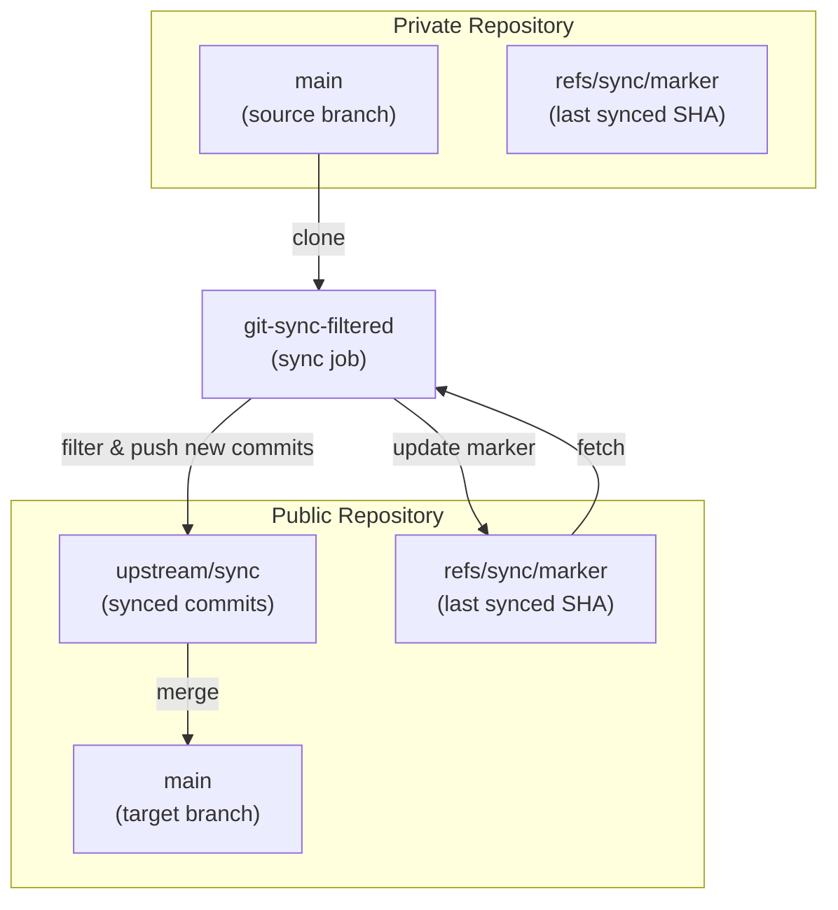

# Code Review Report: Functional Alignment Analysis

## Summary

Based on analysis of the codebase, there are **critical gaps** between the desired behavior and the implementation, specifically around **idempotency**.

---

## Desired Behavior

Given a private source branch and a public destination branch:

1. A sync job can be configured with a set of filters to allow a subset of files to be synced to the destination
2. Any commit that contains one or more of the allowed files should be filtered appropriately and mirrored on the destination along with its commit metadata
3. **No duplicate commits (i.e. commits that have been synced previously) should be synced on subsequent runs (i.e. idempotent)**

---

## Functional Alignment Matrix

| Requirement                         | Status               | Implementation                            |
| ----------------------------------- | -------------------- | ----------------------------------------- |
| Private source → Public destination | ✅ Supported         | `--private` / `--public` options          |
| Filter configuration (keep paths)   | ✅ Supported         | `--keep` / `--keep-from-file` options     |
| Commit filtering with metadata      | ✅ Supported         | Uses `git-filter-repo --partial`          |
| **Idempotent syncing**              | ❌ **NOT Supported** | No mechanism to prevent duplicate commits |

---

## Critical Issue: No Idempotency

**The implementation is NOT idempotent.** Every run pushes ALL commits from the private branch, creating duplicates on subsequent runs.

### Root Cause

In `sync.py:111-120`:

```python
# Every run clones fresh (line 114)
private_repo = git.Repo.clone_from(private, str(private_clone))

# Filters ALL commits in history (line 116)
run_filter_repo(str(private_clone), paths_to_keep)

# Pushes ALL commits to sync_branch (line 70-71 in push_to_remote)
refspec = f"refs/heads/{private_branch}:refs/heads/{sync_branch}"
repo.remote("public").push(refspec=refspec, force=force)
```

There is **no mechanism** to:

1. Track the last synced commit SHA
2. Only sync new commits
3. Detect/avoid duplicate commits

The `--force` flag (line 71) only overwrites the branch, it doesn't prevent duplicate commits from being pushed.

### Additional Technical Notes

- **`--partial` flag** (`sync.py:38`): This flag makes filtering faster by not rewriting commits that don't change the result, but it does NOT provide incremental syncing. It still operates on a fresh clone every time.
- **`--state-branch`**: git-filter-repo supports `--state-branch` for incremental filtering, but this feature is **not currently used** in the implementation.

### Evidence

1. **No idempotency tests exist** - All tests in `tests/integration/test_sync.py` only test single-run scenarios (lines 10-67)
2. **No state tracking** - No code stores/retrieves last synced commit information (entire `sync.py`)
3. **Fresh clone each run** - Every execution starts from scratch (`sync.py:114` - `git.Repo.clone_from`)

---

## Recommended Remediation Plan

### Architecture

To achieve true idempotency, implement a **commit tracking mechanism**:



### How It Works

1. **First Run**: No marker exists → sync ALL commits from private main → create marker with latest SHA
2. **Subsequent Runs**:
   - Fetch marker from public repo to get last synced SHA
   - Only fetch/filter commits newer than marker
   - Push new commits to sync branch
   - Update marker with new latest SHA

### Implementation Options

#### Option A: Track in Public Repo (Recommended)

- Store the last synced commit SHA in a dedicated ref in the public repo (e.g., `refs/sync/marker`)
- On each run:
  1. Fetch the marker ref to get last synced commit
  2. Only fetch commits newer than that SHA
  3. Filter and push new commits
  4. Update marker ref with latest SHA

**Pros:**

- Self-contained (state stays with the repos)
- Works with any remote setup

**Cons:**

- Requires extra fetch/push operations

#### Option B: Use git-filter-repo --state-branch

- Leverage git-filter-repo's built-in `--state-branch` feature for incremental filtering
- Store filter state in a dedicated branch in the public repo
- On each run:
  1. Clone private repo
  2. Import state from previous run (if exists)
  3. Run filter-repo with --state-branch
  4. Export state to public repo

**Pros:**

- Built-in git-filter-repo support
- Handles commit tracking internally

**Cons:**

- More complex state management
- git-filter-repo state may not handle all edge cases

#### Option C: Track in Private Repo

- Store marker in private repo (e.g., as a tag or branch)
- On each run:
  1. Clone private repo (or fetch only new commits)
  2. Find commits since last marker
  3. Filter and push new commits
  4. Update marker in private repo

**Pros:**

- Simpler initial clone

**Cons:**

- Modifies private repo (may not be desired)

#### Option D: External State File

- Store last synced SHA in an external file (local or cloud storage)
- Pass via `--last-synced-sha` CLI option

**Pros:**

- Full control over state

**Cons:**

- Requires external state management
- Less portable

### Implementation Steps (Option A)

1. **Add CLI options**:
   - `--sync-marker-ref` (default: `refs/sync/marker`)
   - Optional: `--reset` to restart sync from beginning

2. **Modify `sync()` function**:
   - Fetch sync marker ref from public remote
   - Determine base commit (last synced or initial)
   - Create a new branch from that commit point
   - Filter only new commits
   - Push new commits
   - Update marker ref

3. **Handle edge cases**:
   - First run (no marker exists) - sync all commits
   - Marker points to commit not in current branch - error or reset
   - Partial failure mid-sync - don't update marker

### File Changes Required

| File                             | Changes                                    |
| -------------------------------- | ------------------------------------------ |
| `cli.py`                         | Add `--sync-marker-ref`, `--reset` options |
| `sync.py`                        | Add idempotency logic in `sync()` function |
| `tests/integration/test_sync.py` | Add idempotency tests                      |
| `tests/unit/...`                 | Add unit tests for new functions           |

### Test Cases to Add

```python
def test_idempotent_sync_no_duplicates(tmp_path):
    """Running sync twice should not create duplicate commits."""
    # First sync
    sync(...)
    # Second sync
    sync(...)
    # Verify only one commit in public repo

def test_idempotent_sync_new_commits(tmp_path):
    """Only new commits should be synced on subsequent runs."""
    # Add new commits to private
    # Run sync
    # Verify only new commits appear in public

def test_first_run_no_marker(tmp_path):
    """First run should work when no marker exists."""
```

---

## Questions for Clarification

1. **What is the expected behavior when new commits are added to the private branch?** Should only new commits be synced, or all commits each time?

2. **Where should the "last synced commit" state be stored?**
   - In the public repository (dedicated branch/ref)?
   - In the private repository?
   - External (file, env var)?

3. **Should the sync be re-runnable after a failure?** (i.e., handle partial syncs gracefully)

4. **Are there concurrent access concerns?** (multiple sync jobs running simultaneously)

5. **Should `--force` be deprecated or work differently with idempotency?**
